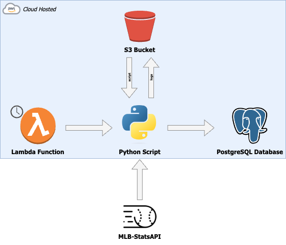
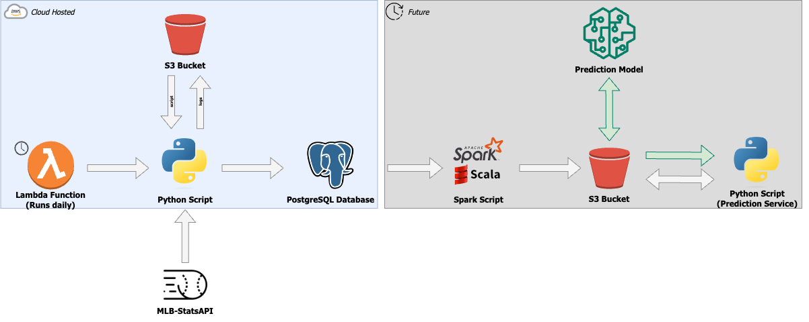

# MLB Win Predictor

In the world of [sabermetrics](https://en.wikipedia.org/wiki/Sabermetrics), traditional stats such as pitcher's earned run average (ERA) and win-loss records have lost some of their weight as success predictors in the MLB. This project aims to determine just how accurate, or inaccurate, ERA and win-loss records are in determing success.

## What Does This Project Do?

In short, this project is two phases:

### Collect Data to Train a Model

The part of this project that has already been developed and deployed. Because I want the statistics for a pitcher *going into* a game, I add all of the pitchers and their ERA, win-loss record, and innings pitched to the database. The next day, I update each game in the database to denote which team won the game. This allows for the most accurate statistics to be used when building the model.

### Building the Prediction Model

The second part of this project will be building the model to be used to predict the outcome of a game based on the starting pitchers' statistics. 

## Schedule

| **Season** | **Plan**                                                                                                                                                                                                                                                                                                                                                                                  |
| ---------- | ----------------------------------------------------------------------------------------------------------------------------------------------------------------------------------------------------------------------------------------------------------------------------------------------------------------------------------------------------------------------------------------- |
| **2023**   | Run a continuous script which will write to a database, for every game, the:   - Starting pitchers (home and away)  - Starting pitchers' ERA  - Starting pitchers' Win-Loss record  - The outcome of the game (which team wins, which team loses)  Then, for the 2024 season, I will build a model from the recorded data in an effort to predict the outcome of games. |
| **2024+**  | Use the aforementioned model to try to predict outcomes of games, record the accuracy, and refine the model/attempt to draw conclusions from this experiment.   If it is immediately evident after one year that ERA and win-loss cannot be accurately used to predict outcomes, I intend to move on to more advanced metrics, such as ERA+, MB/9, etc.                             |

> **Why not use the 2022 season to train for the 2023 season?**
>
> I need to get the data going *into* the game, and unfortunately there is no way to access what, say, John Smith's ERA was before pitching on July 4th, 2022. So, I will be logging each day's matchups with the pitchers' stats going into the game and will then update who won and lost the game the next day.

## Architeture

## Future Architecture

Once the data is collected, I anticipate the architecture looking similar to:

