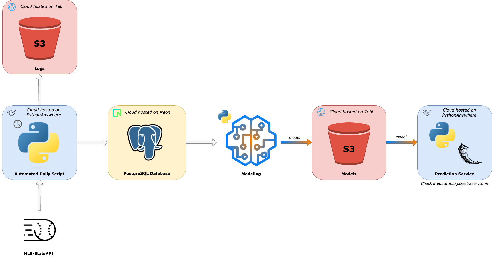

# MLB Win Predictor

In the world of [sabermetrics](https://en.wikipedia.org/wiki/Sabermetrics), traditional stats such as pitcher's earned run average (ERA) and win-loss records have lost some of their weight as success predictors in the MLB. This project aims to determine just how accurate, or inaccurate, traditional and sabermetric statistics can be in predicting the outcome of a baseball game.

This project is hosted entirely on the cloud as a series of microservices. Only modeling work is done locally. See more in [Architecture](#architecture).

## What Does This Project Do?

In short, this project is two phases:

### Collect Data to Train a Model

The part of this project that has already been developed and deployed. Because I want the statistics for a pitcher *going into* a game, I add all of the pitchers and their [ERA](https://library.fangraphs.com/pitching/era/), win-loss record, innings pitched, [K/9](https://en.wikipedia.org/wiki/Strikeouts_per_nine_innings_pitched), [BB/9](https://en.wikipedia.org/wiki/Bases_on_balls_per_nine_innings_pitched), strikeout percentage minus walk percentage (K% - BB%), [WHIP](https://library.fangraphs.com/pitching/whip/), and [BABIP](https://library.fangraphs.com/pitching/babip/) to the database. The next day, I update each game in the database to denote which team won the game. This allows for the most accurate statistics to be used when building the model.

### Building the Prediction Model

The second part of this project will be building the model to be used to predict the outcome of a game based on the starting pitchers' statistics. 

## Schedule

| **Season** | **Plan**                                                                                                                                                                                                                                                                                                                                                                                                                                                                                                                                                                                                                                                                             |
| ---------- | ------------------------------------------------------------------------------------------------------------------------------------------------------------------------------------------------------------------------------------------------------------------------------------------------------------------------------------------------------------------------------------------------------------------------------------------------------------------------------------------------------------------------------------------------------------------------------------------------------------------------------------------------------------------------------------ |
| **2023**   | Run a continuous script which will write to a database, for every game, the:   - Starting pitchers (home and away)  - Starting pitchers' ERA  - Starting pitchers' Win-Loss record  - Starting pitchers' K/9  - Starting pitchers' BB/9  - Starting pitchers' K% - BB%  - Starting pitchers' WHIP  - Starting pitchers' BABIP  - The outcome of the game (which team wins, which team loses)  Then, for the 2024 season, I will build a model from the recorded data in an effort to predict the outcome of games. One model will be using "traditional" statistics, one using "sabermetrics", and another using a combintation of the two.   |
| **2024+**  | Use the aforementioned models to try to predict outcomes of games, record the accuracy, and refine the models/attempt to draw conclusions from this experiment.    *Update: I am currently using the data I have collected to predict and show the results live on [mlb.jakestrasler.com](https://mlb.jakestrasler.com).*                                                                                                                                                                                                                                                                                                                                                      |

> **Why not use the 2022 season to train a model for the 2023 season?**
>
> I need to get the data *going into* the game, and unfortunately there is no way to access what, say, John Smith's ERA was before pitching on July 4th, 2022. So, I will be logging each day's matchups with the pitchers' stats going into the game and will then update who won and lost the game the next day.

## Architecture

This is currently the current architecture project.

*Front end source code can be viewed at [github.com/straslerj/mlb-win-predictor-front-end](https://github.com/straslerj/mlb-win-predictor-front-end).*

